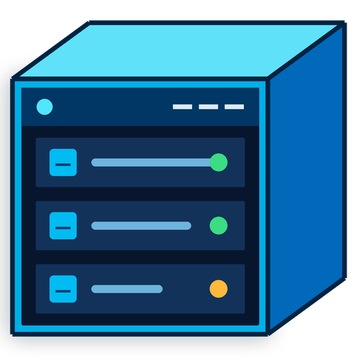

# hyprv

**A modern Hyper-V Manager &amp; Remote Desktop client for Windows.**

> **Vibe-coded — read this before you trust it**
>
> hyprv is **~100% AI-generated.** It was designed and written end-to-end by
> [Claude](https://claude.com/claude-code) through conversational prompting — **no human has
> reviewed the majority of the source code.** It works well for the author's daily Hyper-V use,
> but treat it accordingly.
>
> Use at your own risk. (See the [MIT license](LICENSE) — it ships "AS IS".)

## What it is

hyprv is a from-scratch alternative to the built-in **Hyper-V Manager**, focused on the thing that
tool does worst: actually *using* your VMs. Every virtual machine — and every remote machine —
opens as a **tab with a real, full-featured RDP session**: enhanced-mode graphics, clipboard,
dynamic resize, per-monitor DPI scaling. Around that sits a clean, fast, keyboard-friendly UI for
managing VM state and hardware.

## Features

- **Tabbed VM consoles** — each VM opens in its own tab with a full RDP session (basic *and*
  enhanced mode), clipboard and Ctrl+Alt+Del support, and automatic DPI scaling that matches the host.
- **Remote Desktop hosts** — connect to *any* RDP machine, not just VMs, in the same tabbed UI.
  Credentials are prompt-every-time; **nothing is ever stored or sent by hyprv.**
- **Tear-away tabs &amp; multi-window** — drag a VM out into its own window, or drop it back onto another.
- **Full VM management** — a new-VM wizard, a hardware editor (CPU, memory, disks, network, COM,
  security/vTPM, boot order…), start / stop / save / checkpoint — all from a compact UI.
- **Light / dark / black themes** with Mica and Acrylic backdrops.

## Requirements

- **Windows 11** — x64 or ARM64.
- **Hyper-V enabled** for VM features. (Remote Desktop hosts work without it.)
- A few operations — e.g. offline physical-disk pass-through — require running **elevated**.

## Usage

- Launch **hyprv**. The **welcome page** lists your Hyper-V VMs and any saved Remote Desktop hosts.
- **Click a VM** to open it as a tab and connect. Use the left **rail** or right-click a VM for
  state changes (start/stop/save/checkpoint) and to open its **Settings** editor.
- **Add a Remote Desktop host** from the welcome page to connect to a non-VM machine.
- **Drag a tab** out of the strip to pop it into its own window.

## License

Licensed under the **[MIT License](LICENSE)**. Copyright © 2026 jxy-s.

## Acknowledgements

Built with [Claude Code](https://claude.com/claude-code). Successor to
[VMPlex](https://github.com/0xf005ba11/vmplex-ws).

## Trademarks

Hyper-V is a registered trademark of Microsoft Corporation in the United States and/or other
countries. hyprv is an independent, unaffiliated project and is not endorsed by Microsoft.
